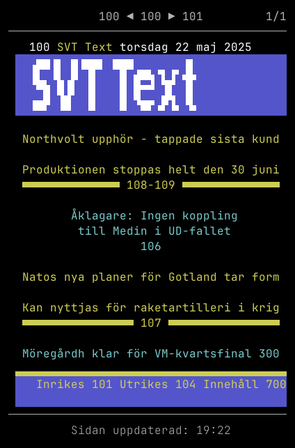
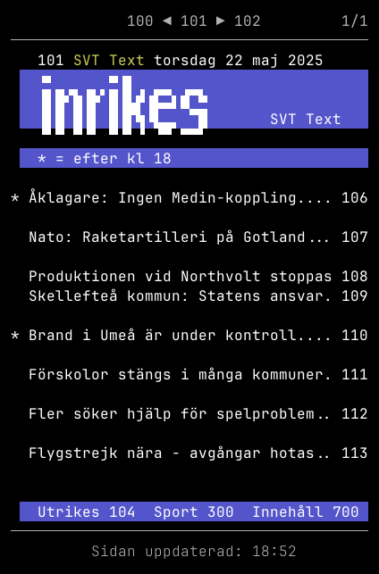
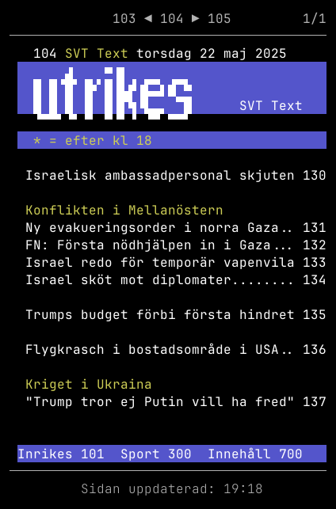
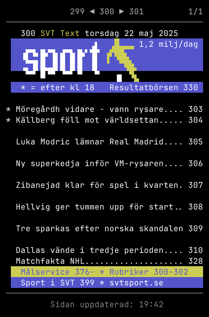
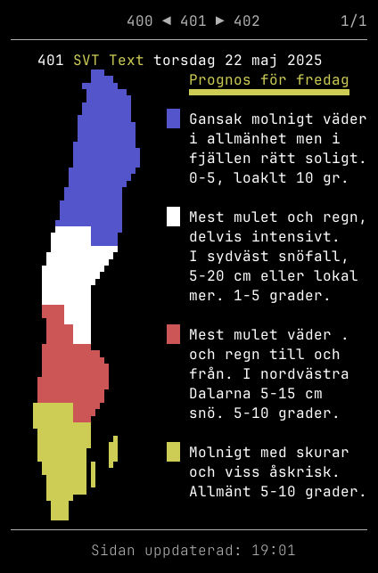

<!-- LOGO -->
<p align="center">
  
</p>

---

Textty är en TUI-klient för SVT Text-TV, med målet att replikera
presentationen av innehållet från ursprungsformatet, [teletext].


## Demonstration

<details>
<summary>Sida 100: Hem</summary>
<p align="center">
  
</p>
</details>

<details>
<summary>Sida 101: Inrikes</summary>
<p align="center">
  
</p>
</details>

<details>
<summary>Sida 104: Utrikes</summary>
<p align="center">
  
</p>
</details>

<details>
<summary>Sida 300: Sport</summary>
<p align="center">
  
</p>
</details>

<details>
<summary>Sida 401: Väderkarta</summary>
<p align="center">
  
</p>
</details>

## Varför Text-TV i terminalen?

De flesta läser idag nyheter på sin smartphone, men telefoners gränssnitt är
utformat för att behålla din uppmärksamhet så länge som möjligt
(_[deathscrolling]_), eller dra din uppmärksamhet till andra appar. Webben är i
sin tur översållad med annonser och du blir spårad av varje webb-sida du
besöker.

Text-TV bör kunna läsas i en rent textbaserad miljö. Målet med Textty är att
tillgängliggöra kortfattade och kärnfulla nyheter _i terminalen_ &mdash; och
ingenting annat.

- Inga annonser; endast innehåll.
- Inga notiser om nyheter eller från andra appar.
- Begränsat innehåll: slösa inte tid på oändligt scrollande.
- Undvik icke-nyheter: läs bara det viktigaste.
- Ingen webbläsare: konsumtion av text-baserat innehåll ska inte behöva en
  komplett webb-motor.
- Stanna i terminalen!

## Installation

Installera genom att ladda ner en förkompilerad exekverbar fil från _releases_,
eller kompilera själv från källkod.

### Release

1. Ladda ner lämplig förkompilerad exekverbar binär från [senaste Release]
2. Gör filen exekverbar (Linux, MacOS)
3. Placera filen på din `PATH`

Exempel:

```sh
curl -L https://github.com/lsjoeberg/textty/releases/download/v0.1.0/textty-linux-amd64 > textty
chmod +x textty
mv textty ~/.local/bin
```

### Cargo

Installera [Rust] och kompilera från GitHub med `cargo`:

```sh
cargo install --locked --git https://github.com/lsjoeberg/textty
```

### Kompilera från lokal källkod

Kräver [Rust] installerat:

```sh
git clone https://github.com/lsjoeberg/textty && cd textty
cargo install --path .
```

## Användning

### Terminal och typsnitt

Applikationen presenterar teletext-innehållet med de Unicode-glyfer som
ingår i den ursprungliga [teletext-standarden]. Standarden inkluderar en
uppsättning glyfer som används för att åstadkomma text-baserad grafik: så
kallade _[block mosaics]_. Ett bra exempel är väder-kartan på sidan [401]. Det
är sällsynt att dessa Unicode-glyfer finns med i vanligt förekommande typsnitt;
det finns två alternativ för att rendera innehållet korrekt i terminalen:

1. Installera ett typsnitt som innehåller mosaik-glyferna, och använd typsnittet
   i din terminal-emulator.
2. Använd en terminal-emulator med internt stöd för exotiska glyfer. Två
   kompetenta emulatorer som klarar att rendera teletext-glyfer utan
   konfiguration är [ghostty] och [wezterm].

### Gränssnitt och navigation

Gränssnittet består av en *navigationsrad* ovanför visning av sidans innehåll.

```text
  läser 8e bladet av 15 på sida 331 ─┐
                                     │
----------------------------------------
             330 ◀ 331 ▶ 332        8/15
----------------------------------------
              │     │     └ nästa sida
              │     └ nuvarande sida
              └ föregående sida
```

#### Läsläge

| Keys     | Action               |
|:---------|:---------------------|
| `←`, `h` | previous page        |
| `→`, `l` | next page            |
| `↑`, `k` | scroll up            |
| `↓`, `j` | scroll down          |
| `r`      | refresh page         |
| `1`-`8`  | jump to page 100-800 |
| `?`      | show help page       |
| `q`      | quit application     |

#### Kommandoläge

| Keys    | Action                |
|---------|-----------------------|
| `:`     | enter page input mode |
| `0`-`9` | input page number     |
| `↵`     | submit page number    |
| `Esc`   | exit input mode       |


## Alternativa klienter

- [wille1101/sttg](https://github.com/wille1101/sttg)
- [voidcase/txtv](https://github.com/voidcase/txtv)
- [erikstenlund/texttv](https://github.com/erikstenlund/texttv)
- [boomlinde/texttv](https://github.com/boomlinde/texttv)

## Erkännanden

Textty hämtar sitt innehåll från [TextTv.nu], och är helt beroende av det API
som tillhandahålls jämte webbsidan. SVT ansvarar givetvis för journalistik och
publikation av sidorna på Text-TV, också tillgängligt på [svt.se/text-tv]. Mer
och uppdaterad information om SVT Text-TV finns på sida [711].

<!-- Referenser -->
[teletext]: https://sv.wikipedia.org/wiki/Text-TV
[deathscrolling]: https://www.urbandictionary.com/define.php?term=deathscrolling
[Rust]: https://www.rust-lang.org/tools/install
[senaste Release]: https://github.com/lsjoeberg/textty/releases/latest
[teletext-standarden]: https://en.wikipedia.org/wiki/Teletext_character_set
[401]: https://www.svt.se/text-tv/401
[block mosaics]: https://en.wikipedia.org/wiki/Teletext_character_set#G1_block_mosaics
[ghostty]: https://ghostty.org/
[wezterm]: https://wezterm.org/
[TextTv.nu]: https://texttv.nu/blogg/texttv-api
[svt.se/text-tv]: https://www.svt.se/text-tv
[711]: https://www.svt.se/text-tv/711
